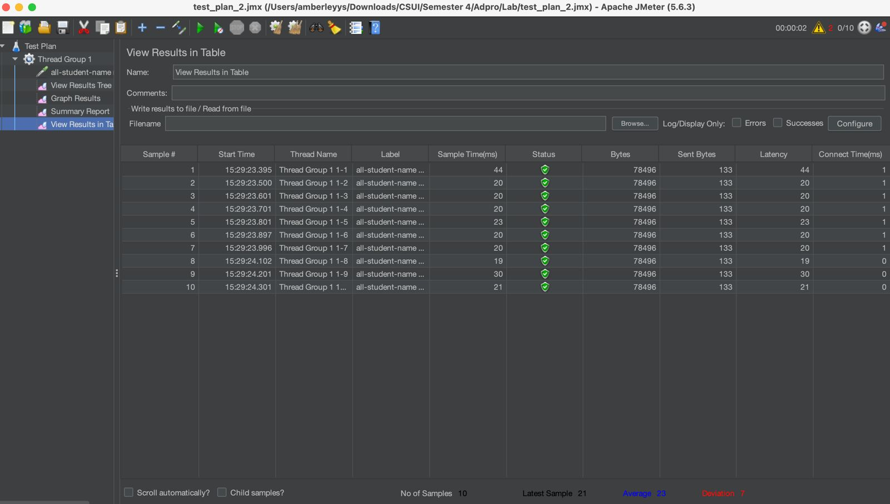
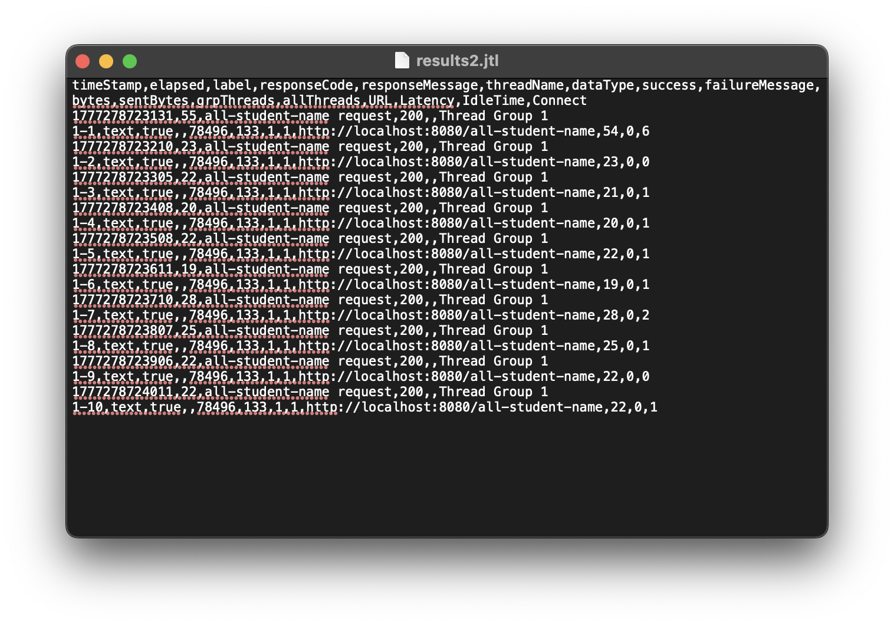
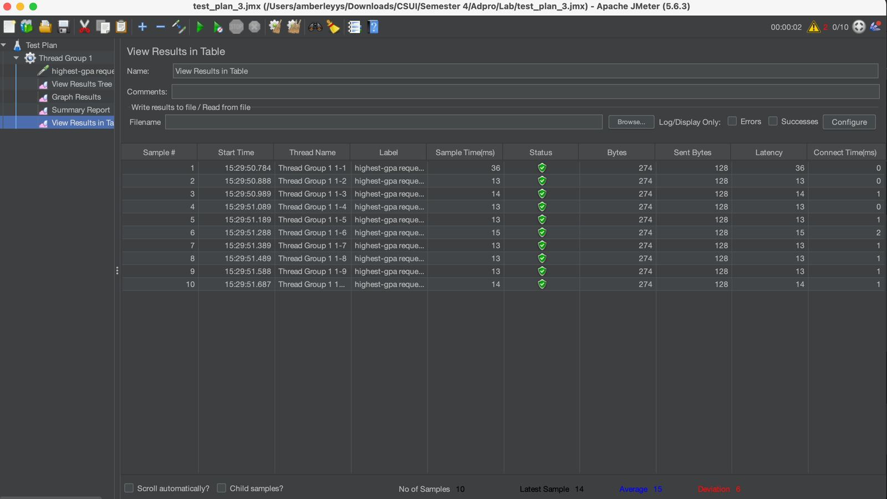
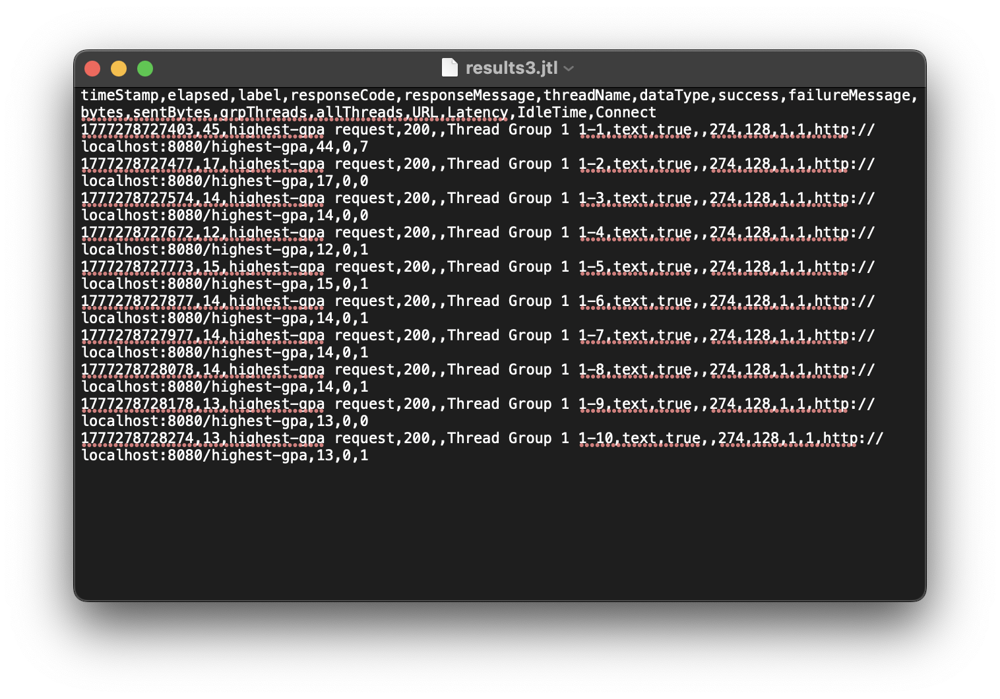

## Performance Testing

### 1. Testing `/all-student-name`

I created a test plan in JMeter to test the `/all-student-name` endpoint.  
The test simulates 10 users sending requests at the same time.

After running the test in GUI mode, I observed the response times and status of each request.

From the results above, all requests were processed successfully and the response times are shown in milliseconds. This shows how fast the endpoint responds under multiple users.

I also ran the same test using the command line (non-GUI mode) to get the result log file.

---

### 2. Testing `/highest-gpa`

Next, I created another test plan for the `/highest-gpa` endpoint using the same configuration (10 users, 1 second ramp-up).

After running the test in GUI mode, I checked the results:

The results show the response time for each request. All requests were successful, which means the endpoint works correctly under load.

I also executed this test using the command line:

