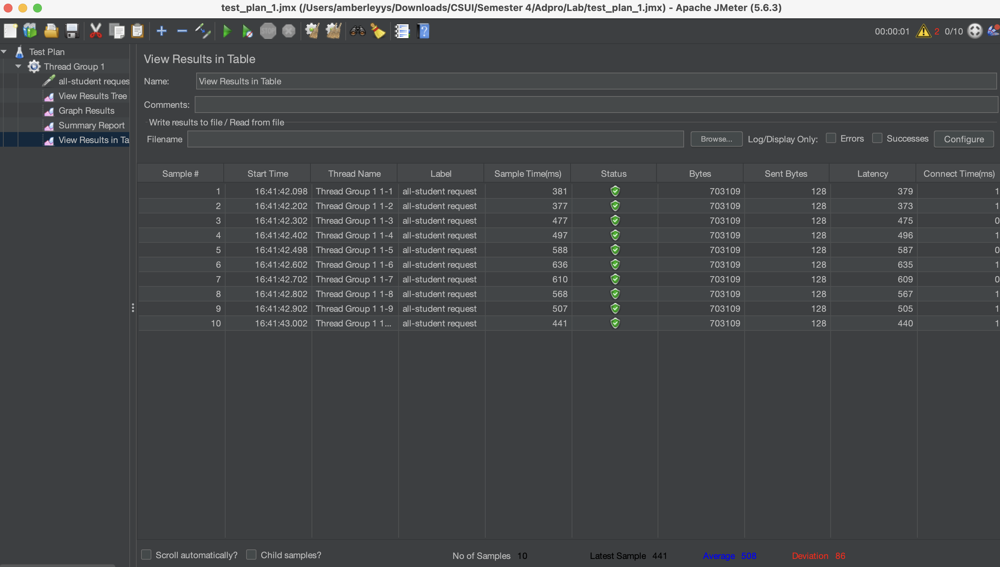
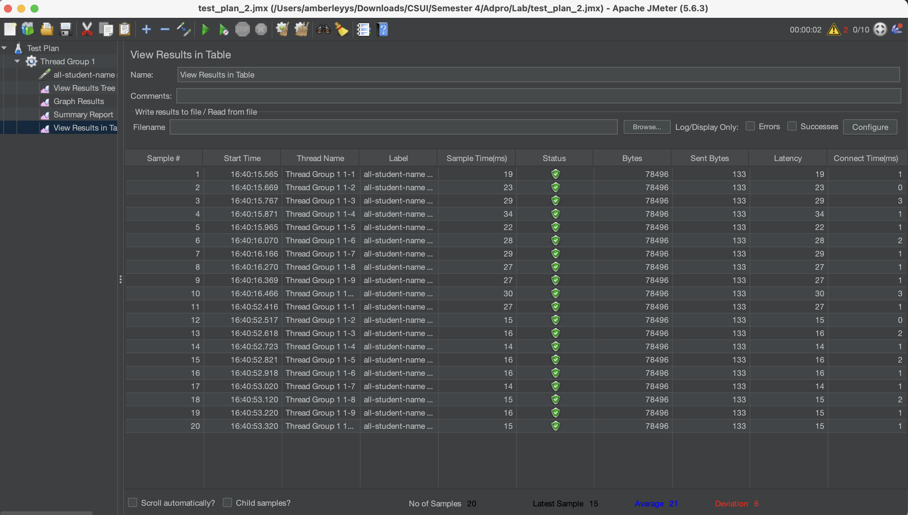
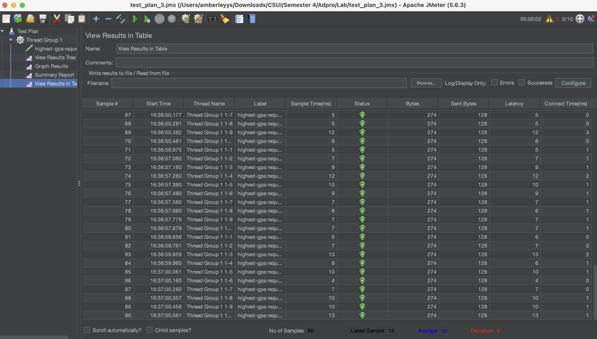

## Performance Testing

### 1. Testing `/all-student-name`

I created a test plan in JMeter to test the `/all-student-name` endpoint.  
The test simulates 10 users sending requests at the same time.

After running the test in GUI mode, I observed the response times and status of each request.

From the results above, all requests were processed successfully and the response times are shown in milliseconds. This shows how fast the endpoint responds under multiple users.

I also ran the same test using the command line (non-GUI mode) to get the result log file.

---

### 2. Testing `/highest-gpa`

Next, I created another test plan for the `/highest-gpa` endpoint using the same configuration (10 users, 1 second ramp-up).

After running the test in GUI mode, I checked the results:

The results show the response time for each request. All requests were successful, which means the endpoint works correctly under load.

I also executed this test using the command line:

## Performance Optimization Results

### CPU Profiling (After Optimization)

After optimizing the methods in `StudentService`, I ran the profiler again to check the CPU time.

The main improvements were in:
- `getAllStudentsWithCourses()`
- `joinStudentNames()`
- `findStudentWithHighestGpa()`

After refactoring, the CPU time for these methods decreased. This means that the code is now more efficient compared to the previous version.

---

## JMeter Performance Testing (After Optimization)

### /all-student

---

### /all-student-name

---

### /highest-gpa

---

## Compare JMeter output

After running JMeter again, the response times are faster compared to the first test. The endpoints now handle requests more efficiently, and the sample times are lower than before.